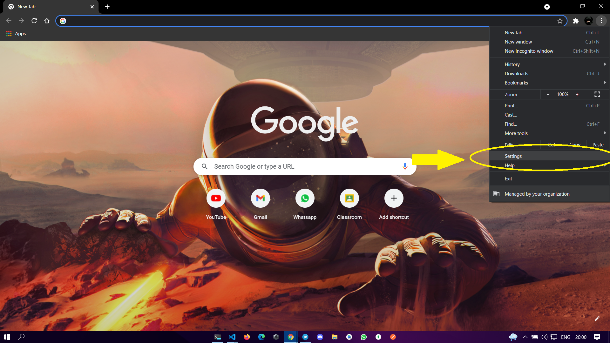
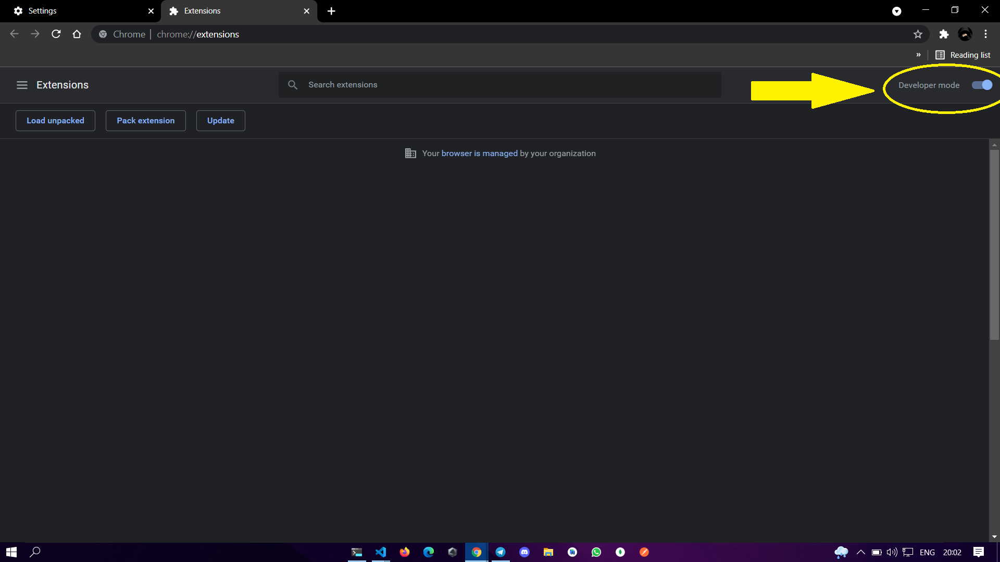
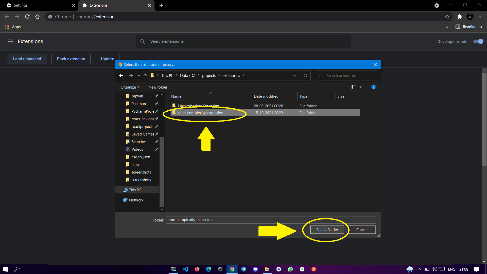

# Time-Complexity-Extension
A browser extension that gives the time complexity of various algorithms randomly on every time you open the extension or click on the Next button while using it.

 

### How to install the unpacked extension in Chrome ?

- Go to **settings** chrome

- Click on the button **"extension"**

- Activate **developer mode**

- Click on the button to load **extension** folder

- Load the folder

### Happy Coding 🚀
